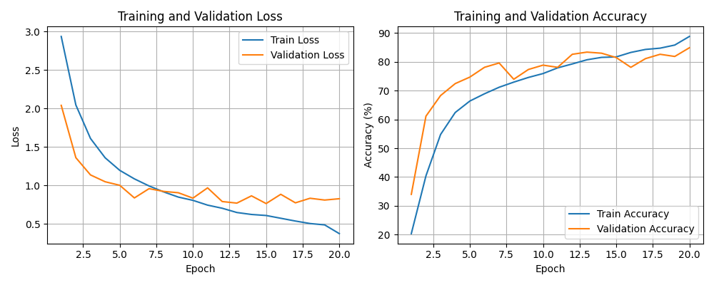
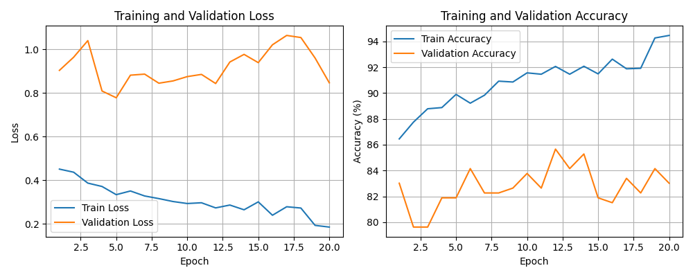
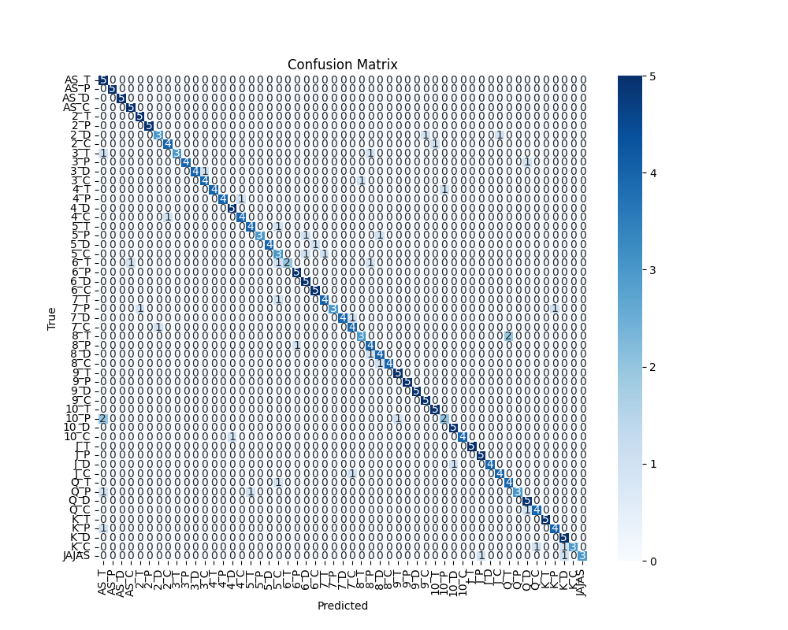
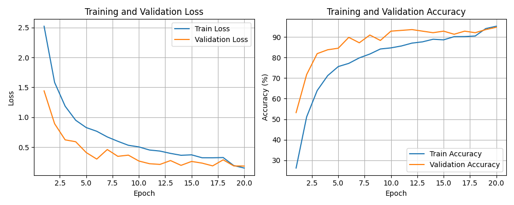
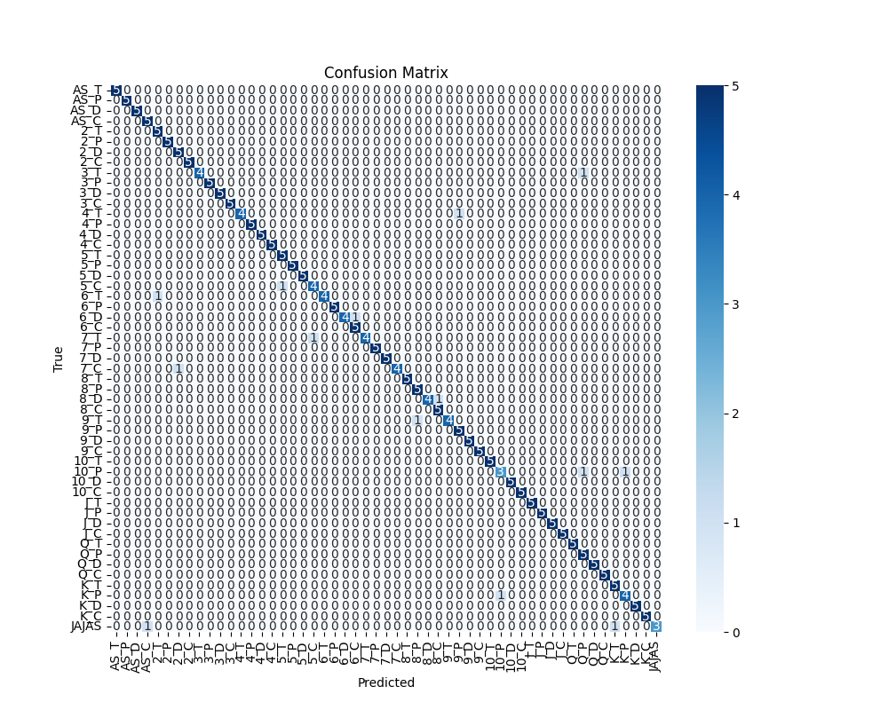

# **Configuración 4**

Esta es la configuracion estandar de nuestra red neuronal.

### **Hiperparametros**

EPOCHS = 20
LR = 1e-3
SEED = 0
BATCH_SIZE =16
FactorReduccion = 0.3  
Paciencia = 5     

**Resultados sin pesos**

[Epoch 1] train_loss: 2.936 | train_acc: 20.32% | dev_loss: 2.040 | dev_acc: 33.96% | lr=0.001000  
[Epoch 2] train_loss: 2.045 | train_acc: 40.39% | dev_loss: 1.359 | dev_acc: 61.13% | lr=0.001000  
[Epoch 3] train_loss: 1.609 | train_acc: 54.77% | dev_loss: 1.135 | dev_acc: 68.30% | lr=0.001000  
[Epoch 4] train_loss: 1.358 | train_acc: 62.41% | dev_loss: 1.046 | dev_acc: 72.45% | lr=0.001000  
[Epoch 5] train_loss: 1.194 | train_acc: 66.40% | dev_loss: 1.000 | dev_acc: 74.72% | lr=0.001000  
[Epoch 6] train_loss: 1.084 | train_acc: 68.91% | dev_loss: 0.836 | dev_acc: 78.11% | lr=0.001000  
[Epoch 7] train_loss: 0.992 | train_acc: 71.18% | dev_loss: 0.956 | dev_acc: 79.62% | lr=0.001000  
[Epoch 8] train_loss: 0.914 | train_acc: 72.97% | dev_loss: 0.920 | dev_acc: 73.96% | lr=0.001000  
[Epoch 9] train_loss: 0.847 | train_acc: 74.59% | dev_loss: 0.903 | dev_acc: 77.36% | lr=0.001000  
[Epoch 10] train_loss: 0.804 | train_acc: 75.94% | dev_loss: 0.833 | dev_acc: 78.87% | lr=0.001000  
[Epoch 11] train_loss: 0.742 | train_acc: 77.92% | dev_loss: 0.967 | dev_acc: 78.11% | lr=0.001000  
[Epoch 12] train_loss: 0.701 | train_acc: 79.29% | dev_loss: 0.789 | dev_acc: 82.64% | lr=0.001000  
[Epoch 13] train_loss: 0.646 | train_acc: 80.73% | dev_loss: 0.768 | dev_acc: 83.40% | lr=0.001000  
[Epoch 14] train_loss: 0.621 | train_acc: 81.57% | dev_loss: 0.863 | dev_acc: 83.02% | lr=0.001000  
[Epoch 15] train_loss: 0.607 | train_acc: 81.73% | dev_loss: 0.763 | dev_acc: 81.51% | lr=0.001000  
[Epoch 16] train_loss: 0.571 | train_acc: 83.29% | dev_loss: 0.883 | dev_acc: 78.11% | lr=0.001000  
[Epoch 17] train_loss: 0.535 | train_acc: 84.33% | dev_loss: 0.772 | dev_acc: 81.13% | lr=0.001000  
[Epoch 18] train_loss: 0.503 | train_acc: 84.77% | dev_loss: 0.831 | dev_acc: 82.64% | lr=0.001000  
[Epoch 19] train_loss: 0.485 | train_acc: 85.85% | dev_loss: 0.808 | dev_acc: 81.89% | lr=0.000300  
[Epoch 20] train_loss: 0.371 | train_acc: 88.84% | dev_loss: 0.825 | dev_acc: 84.91% | lr=0.000300  

Evaluación final en test:
**Accuracy final en test: 84.91%** 

Función de pérdida y de precision

Matriz de Confusion

**Resultados con pesos**

[Epoch 1] train_loss: 0.451 | train_acc: 86.45% | dev_loss: 0.903 | dev_acc: 83.02% | lr=0.001000  
[Epoch 2] train_loss: 0.437 | train_acc: 87.75% | dev_loss: 0.963 | dev_acc: 79.62% | lr=0.001000  
[Epoch 3] train_loss: 0.387 | train_acc: 88.79% | dev_loss: 1.039 | dev_acc: 79.62% | lr=0.001000  
[Epoch 4] train_loss: 0.371 | train_acc: 88.88% | dev_loss: 0.809 | dev_acc: 81.89% | lr=0.001000  
[Epoch 5] train_loss: 0.334 | train_acc: 89.90% | dev_loss: 0.778 | dev_acc: 81.89% | lr=0.001000  
[Epoch 6] train_loss: 0.350 | train_acc: 89.22% | dev_loss: 0.881 | dev_acc: 84.15% | lr=0.001000  
[Epoch 7] train_loss: 0.328 | train_acc: 89.83% | dev_loss: 0.886 | dev_acc: 82.26% | lr=0.001000  
[Epoch 8] train_loss: 0.316 | train_acc: 90.92% | dev_loss: 0.844 | dev_acc: 82.26% | lr=0.001000  
[Epoch 9] train_loss: 0.302 | train_acc: 90.86% | dev_loss: 0.855 | dev_acc: 82.64% | lr=0.001000  
[Epoch 10] train_loss: 0.293 | train_acc: 91.57% | dev_loss: 0.874 | dev_acc: 83.77% | lr=0.001000  
[Epoch 11] train_loss: 0.296 | train_acc: 91.46% | dev_loss: 0.885 | dev_acc: 82.64% | lr=0.001000  
[Epoch 12] train_loss: 0.273 | train_acc: 92.06% | dev_loss: 0.843 | dev_acc: 85.66% | lr=0.001000  
[Epoch 13] train_loss: 0.286 | train_acc: 91.46% | dev_loss: 0.941 | dev_acc: 84.15% | lr=0.001000  
[Epoch 14] train_loss: 0.264 | train_acc: 92.08% | dev_loss: 0.976 | dev_acc: 85.28% | lr=0.001000  
[Epoch 15] train_loss: 0.301 | train_acc: 91.49% | dev_loss: 0.939 | dev_acc: 81.89% | lr=0.001000  
[Epoch 16] train_loss: 0.239 | train_acc: 92.63% | dev_loss: 1.020 | dev_acc: 81.51% | lr=0.001000  
[Epoch 17] train_loss: 0.278 | train_acc: 91.88% | dev_loss: 1.063 | dev_acc: 83.40% | lr=0.001000  
[Epoch 18] train_loss: 0.272 | train_acc: 91.92% | dev_loss: 1.054 | dev_acc: 82.26% | lr=0.000300  
[Epoch 19] train_loss: 0.193 | train_acc: 94.27% | dev_loss: 0.960 | dev_acc: 84.15% | lr=0.000300  
[Epoch 20] train_loss: 0.185 | train_acc: 94.46% | dev_loss: 0.846 | dev_acc: 83.02% | lr=0.000300  

Evaluación final en test:
**Accuracy final en test: 83.02%**

Función de pérdida y de precision

Matriz de Confusion

**Resultados usando Transfer Leaarning**|

[Epoch 1] train_loss: 2.521 | train_acc: 26.25% | dev_loss: 1.441 | dev_acc: 53.21% | lr=0.001000  
[Epoch 2] train_loss: 1.582 | train_acc: 51.11% | dev_loss: 0.892 | dev_acc: 71.70% | lr=0.001000  
[Epoch 3] train_loss: 1.185 | train_acc: 63.93% | dev_loss: 0.623 | dev_acc: 81.89% | lr=0.001000  
[Epoch 4] train_loss: 0.950 | train_acc: 71.20% | dev_loss: 0.592 | dev_acc: 83.77% | lr=0.001000  
[Epoch 5] train_loss: 0.828 | train_acc: 75.60% | dev_loss: 0.411 | dev_acc: 84.53% | lr=0.001000  
[Epoch 6] train_loss: 0.766 | train_acc: 77.15% | dev_loss: 0.302 | dev_acc: 89.81% | lr=0.001000  
[Epoch 7] train_loss: 0.672 | train_acc: 79.83% | dev_loss: 0.462 | dev_acc: 87.17% | lr=0.001000  
[Epoch 8] train_loss: 0.599 | train_acc: 81.70% | dev_loss: 0.348 | dev_acc: 90.94% | lr=0.001000  
[Epoch 9] train_loss: 0.532 | train_acc: 84.16% | dev_loss: 0.368 | dev_acc: 88.30% | lr=0.001000  
[Epoch 10] train_loss: 0.505 | train_acc: 84.69% | dev_loss: 0.269 | dev_acc: 92.83% | lr=0.001000  
[Epoch 11] train_loss: 0.454 | train_acc: 85.62% | dev_loss: 0.225 | dev_acc: 93.21% | lr=0.001000  
[Epoch 12] train_loss: 0.436 | train_acc: 87.01% | dev_loss: 0.213 | dev_acc: 93.58% | lr=0.001000  
[Epoch 13] train_loss: 0.397 | train_acc: 87.63% | dev_loss: 0.277 | dev_acc: 92.83% | lr=0.001000  
[Epoch 14] train_loss: 0.365 | train_acc: 88.89% | dev_loss: 0.197 | dev_acc: 92.08% | lr=0.001000  
[Epoch 15] train_loss: 0.373 | train_acc: 88.60% | dev_loss: 0.263 | dev_acc: 92.83% | lr=0.001000  
[Epoch 16] train_loss: 0.324 | train_acc: 90.15% | dev_loss: 0.234 | dev_acc: 91.32% | lr=0.001000  
[Epoch 17] train_loss: 0.323 | train_acc: 90.19% | dev_loss: 0.188 | dev_acc: 92.83% | lr=0.001000  
[Epoch 18] train_loss: 0.328 | train_acc: 90.46% | dev_loss: 0.289 | dev_acc: 92.08% | lr=0.000300  
[Epoch 19] train_loss: 0.194 | train_acc: 94.08% | dev_loss: 0.188 | dev_acc: 93.58% | lr=0.000300  
[Epoch 20] train_loss: 0.152 | train_acc: 95.23% | dev_loss: 0.185 | dev_acc: 94.72% | lr=0.000300  

Evaluación final en test:
**Accuracy final en test: 94.72%**

Función de pérdida y de precision

Matriz de Confusion

