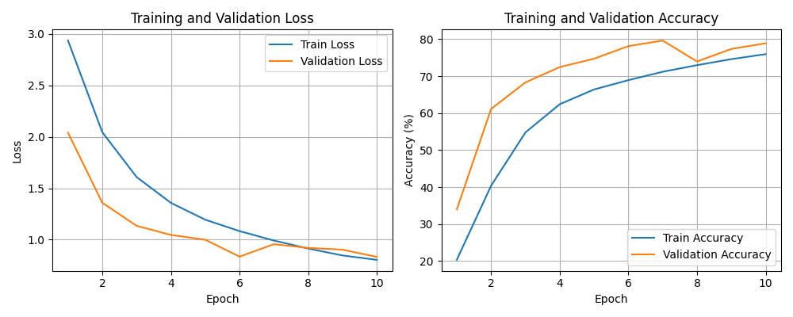
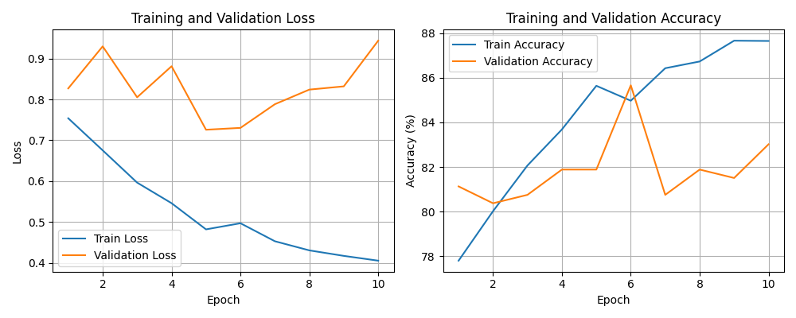
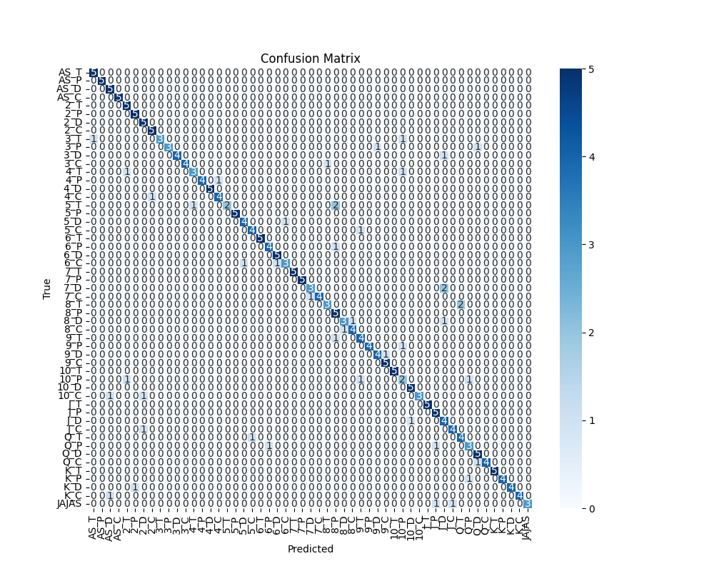
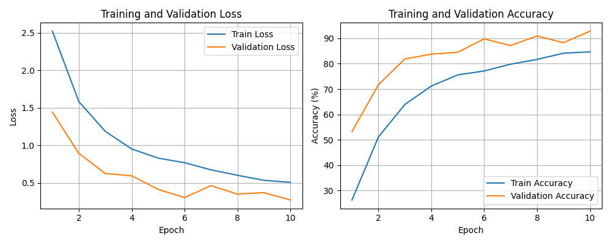
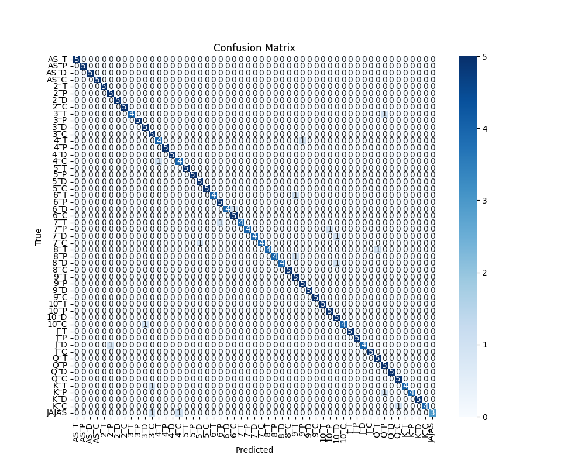

# 🎯 Configuración 1

## **⚙️ Hiperparámetros**
| Parámetro       | Valor   |
|-----------------|---------|
| **EPOCHS**      | 10      |
| **LR**          | 1e-3    |
| **SEED**        | 0       |
| **BATCH_SIZE**  | 16      |
| **FactorReduccion** | 0.75 |
| **Paciencia**   | 3       |

                                                                                      
## **1️⃣ Resultados Sin Pesos** 
```
[Epoch 1] train_loss: 2.936 | train_acc: 20.32% | dev_loss: 2.040 | dev_acc: 33.96% | lr=0.001000  
[Epoch 2] train_loss: 2.045 | train_acc: 40.39% | dev_loss: 1.359 | dev_acc: 61.13% | lr=0.001000  
[Epoch 3] train_loss: 1.609 | train_acc: 54.77% | dev_loss: 1.135 | dev_acc: 68.30% | lr=0.001000  
[Epoch 4] train_loss: 1.358 | train_acc: 62.41% | dev_loss: 1.046 | dev_acc: 72.45% | lr=0.001000  
[Epoch 5] train_loss: 1.194 | train_acc: 66.40% | dev_loss: 1.000 | dev_acc: 74.72% | lr=0.001000  
[Epoch 6] train_loss: 1.084 | train_acc: 68.91% | dev_loss: 0.836 | dev_acc: 78.11% | lr=0.001000  
[Epoch 7] train_loss: 0.992 | train_acc: 71.18% | dev_loss: 0.956 | dev_acc: 79.62% | lr=0.001000  
[Epoch 8] train_loss: 0.914 | train_acc: 72.97% | dev_loss: 0.920 | dev_acc: 73.96% | lr=0.001000  
[Epoch 9] train_loss: 0.847 | train_acc: 74.59% | dev_loss: 0.903 | dev_acc: 77.36% | lr=0.001000  
[Epoch 10] train_loss: 0.804 | train_acc: 75.94% | dev_loss: 0.833 | dev_acc: 78.87% | lr=0.001000  
```
Evaluación final en test:
**Accuracy final en test: 78.87%** 





                                                                
                                                                                                                                          
## **2️⃣ Resultados Con Pesos**
```
[Epoch 1] train_loss: 0.754 | train_acc: 77.81% | dev_loss: 0.827 | dev_acc: 81.13% | lr=0.001000  
[Epoch 2] train_loss: 0.675 | train_acc: 80.02% | dev_loss: 0.930 | dev_acc: 80.38% | lr=0.001000  
[Epoch 3] train_loss: 0.596 | train_acc: 82.07% | dev_loss: 0.805 | dev_acc: 80.75% | lr=0.001000  
[Epoch 4] train_loss: 0.546 | train_acc: 83.68% | dev_loss: 0.881 | dev_acc: 81.89% | lr=0.001000  
[Epoch 5] train_loss: 0.482 | train_acc: 85.64% | dev_loss: 0.726 | dev_acc: 81.89% | lr=0.001000  
[Epoch 6] train_loss: 0.497 | train_acc: 84.97% | dev_loss: 0.730 | dev_acc: 85.66% | lr=0.001000  
[Epoch 7] train_loss: 0.453 | train_acc: 86.42% | dev_loss: 0.788 | dev_acc: 80.75% | lr=0.001000  
[Epoch 8] train_loss: 0.431 | train_acc: 86.73% | dev_loss: 0.824 | dev_acc: 81.89% | lr=0.001000  
[Epoch 9] train_loss: 0.417 | train_acc: 87.66% | dev_loss: 0.832 | dev_acc: 81.51% | lr=0.001000  
[Epoch 10] train_loss: 0.405 | train_acc: 87.64% | dev_loss: 0.944 | dev_acc: 83.02% | lr=0.000750  
```
Evaluación final en test:
**Accuracy final en test: 83.02%**






                                                                                         
## **3️⃣ Resultados Con Transfer Learning** 🎉
```
[Epoch 1] train_loss: 2.521 | train_acc: 26.25% | dev_loss: 1.441 | dev_acc: 53.21% | lr=0.001000  
[Epoch 2] train_loss: 1.582 | train_acc: 51.11% | dev_loss: 0.892 | dev_acc: 71.70% | lr=0.001000  
[Epoch 3] train_loss: 1.185 | train_acc: 63.93% | dev_loss: 0.623 | dev_acc: 81.89% | lr=0.001000  
[Epoch 4] train_loss: 0.950 | train_acc: 71.20% | dev_loss: 0.592 | dev_acc: 83.77% | lr=0.001000  
[Epoch 5] train_loss: 0.828 | train_acc: 75.60% | dev_loss: 0.411 | dev_acc: 84.53% | lr=0.001000  
[Epoch 6] train_loss: 0.766 | train_acc: 77.15% | dev_loss: 0.302 | dev_acc: 89.81% | lr=0.001000  
[Epoch 7] train_loss: 0.672 | train_acc: 79.83% | dev_loss: 0.462 | dev_acc: 87.17% | lr=0.001000  
[Epoch 8] train_loss: 0.599 | train_acc: 81.70% | dev_loss: 0.348 | dev_acc: 90.94% | lr=0.001000  
[Epoch 9] train_loss: 0.532 | train_acc: 84.16% | dev_loss: 0.368 | dev_acc: 88.30% | lr=0.001000  
[Epoch 10] train_loss: 0.505 | train_acc: 84.69% | dev_loss: 0.269 | dev_acc: 92.83% | lr=0.001000  
```
Evaluación final en test:
**Accuracy final en test: 92.83%**






