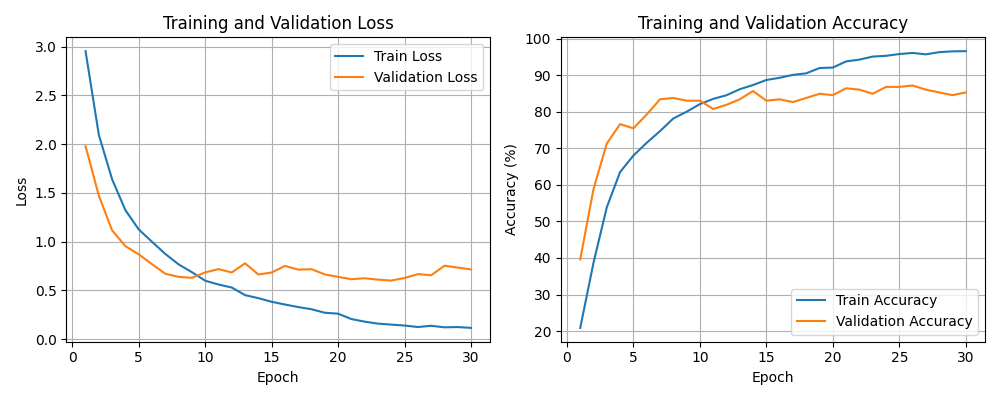
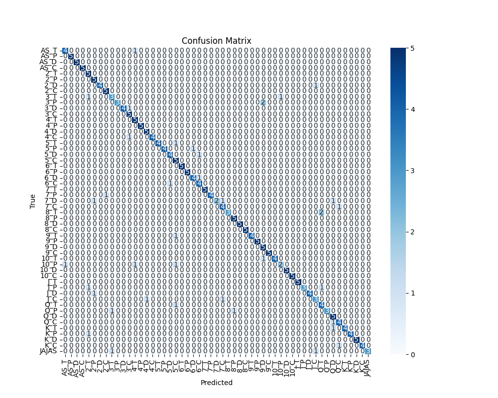
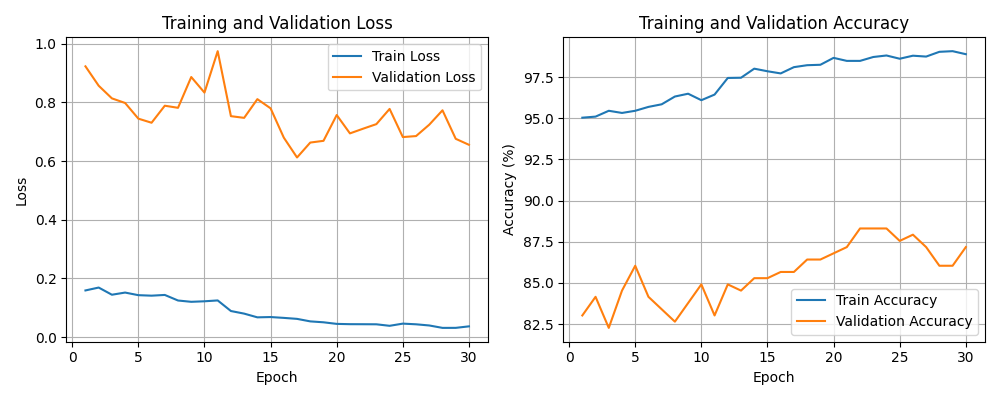
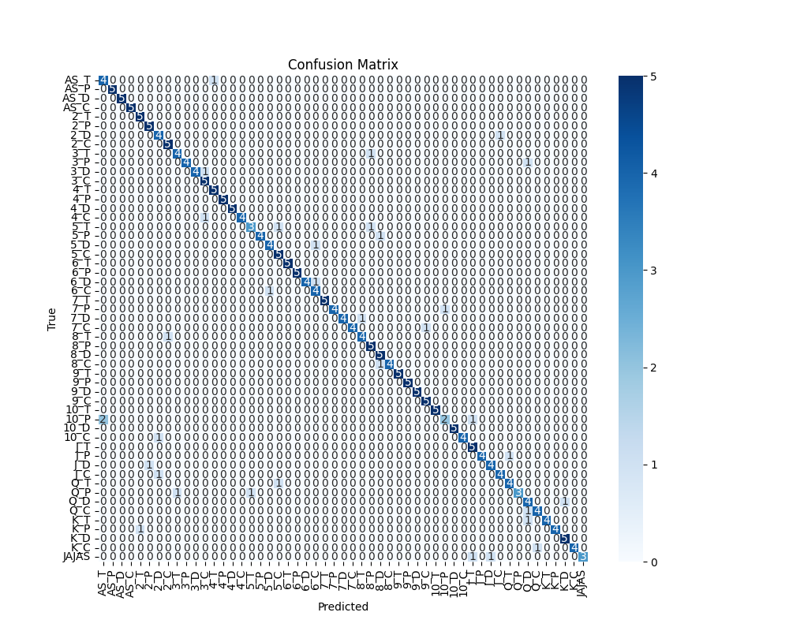
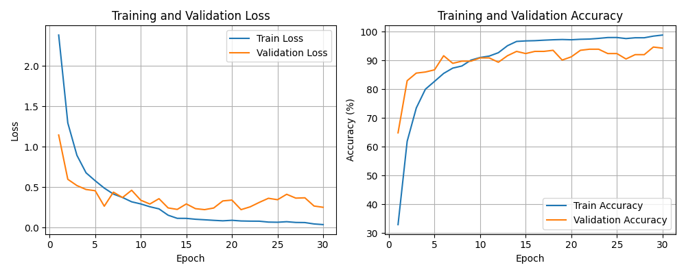
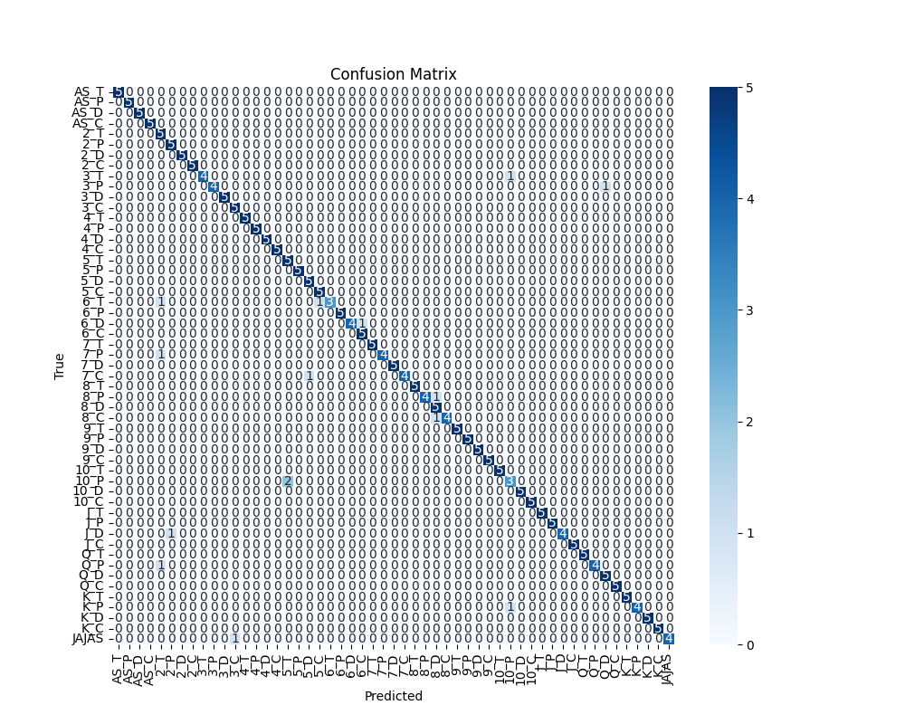

# **Configuración 5**

Esta es la configuracion estandar de nuestra red neuronal.

### **Hiperparámetros**
EPOCHS = 15              
LR = 1e-3                               
SEED = 0                
BATCH_SIZE =32               
FactorReduccion = 0.75                           
Paciencia = 3                  

**Resultados sin pesos**

[Epoch 1] train_loss: 2.952 | train_acc: 20.88% | dev_loss: 1.978 | dev_acc: 39.62% | lr=0.000300  
[Epoch 2] train_loss: 2.094 | train_acc: 38.73% | dev_loss: 1.470 | dev_acc: 58.87% | lr=0.000300  
[Epoch 3] train_loss: 1.638 | train_acc: 53.88% | dev_loss: 1.115 | dev_acc: 71.32% | lr=0.000300  
[Epoch 4] train_loss: 1.322 | train_acc: 63.52% | dev_loss: 0.954 | dev_acc: 76.60% | lr=0.000300  
[Epoch 5] train_loss: 1.125 | train_acc: 68.01% | dev_loss: 0.870 | dev_acc: 75.47% | lr=0.000300  
[Epoch 6] train_loss: 0.998 | train_acc: 71.50% | dev_loss: 0.769 | dev_acc: 79.25% | lr=0.000300  
[Epoch 7] train_loss: 0.874 | train_acc: 74.70% | dev_loss: 0.671 | dev_acc: 83.40% | lr=0.000300  
[Epoch 8] train_loss: 0.767 | train_acc: 78.15% | dev_loss: 0.639 | dev_acc: 83.77% | lr=0.000300  
[Epoch 9] train_loss: 0.687 | train_acc: 80.00% | dev_loss: 0.629 | dev_acc: 83.02% | lr=0.000300  
[Epoch 10] train_loss: 0.599 | train_acc: 82.08% | dev_loss: 0.684 | dev_acc: 83.02% | lr=0.000300  
[Epoch 11] train_loss: 0.561 | train_acc: 83.51% | dev_loss: 0.718 | dev_acc: 80.75% | lr=0.000300  
[Epoch 12] train_loss: 0.530 | train_acc: 84.51% | dev_loss: 0.684 | dev_acc: 81.89% | lr=0.000300  
[Epoch 13] train_loss: 0.451 | train_acc: 86.15% | dev_loss: 0.778 | dev_acc: 83.40% | lr=0.000300  
[Epoch 14] train_loss: 0.421 | train_acc: 87.30% | dev_loss: 0.663 | dev_acc: 85.66% | lr=0.000300  
[Epoch 15] train_loss: 0.383 | train_acc: 88.68% | dev_loss: 0.683 | dev_acc: 83.02% | lr=0.000300  
[Epoch 16] train_loss: 0.355 | train_acc: 89.28% | dev_loss: 0.751 | dev_acc: 83.40% | lr=0.000300  
[Epoch 17] train_loss: 0.329 | train_acc: 90.08% | dev_loss: 0.713 | dev_acc: 82.64% | lr=0.000300  
[Epoch 18] train_loss: 0.307 | train_acc: 90.50% | dev_loss: 0.717 | dev_acc: 83.77% | lr=0.000300  
[Epoch 19] train_loss: 0.271 | train_acc: 91.95% | dev_loss: 0.664 | dev_acc: 84.91% | lr=0.000300  
[Epoch 20] train_loss: 0.262 | train_acc: 92.08% | dev_loss: 0.639 | dev_acc: 84.53% | lr=0.000150  
[Epoch 21] train_loss: 0.207 | train_acc: 93.76% | dev_loss: 0.615 | dev_acc: 86.42% | lr=0.000150  
[Epoch 22] train_loss: 0.180 | train_acc: 94.25% | dev_loss: 0.625 | dev_acc: 86.04% | lr=0.000150  
[Epoch 23] train_loss: 0.159 | train_acc: 95.08% | dev_loss: 0.611 | dev_acc: 84.91% | lr=0.000150  
[Epoch 24] train_loss: 0.150 | train_acc: 95.29% | dev_loss: 0.601 | dev_acc: 86.79% | lr=0.000150  
[Epoch 25] train_loss: 0.140 | train_acc: 95.78% | dev_loss: 0.627 | dev_acc: 86.79% | lr=0.000150  
[Epoch 26] train_loss: 0.125 | train_acc: 96.08% | dev_loss: 0.667 | dev_acc: 87.17% | lr=0.000150  
[Epoch 27] train_loss: 0.137 | train_acc: 95.70% | dev_loss: 0.655 | dev_acc: 86.04% | lr=0.000150  
[Epoch 28] train_loss: 0.122 | train_acc: 96.29% | dev_loss: 0.753 | dev_acc: 85.28% | lr=0.000150  
[Epoch 29] train_loss: 0.124 | train_acc: 96.51% | dev_loss: 0.734 | dev_acc: 84.53% | lr=0.000150  
[Epoch 30] train_loss: 0.116 | train_acc: 96.56% | dev_loss: 0.715 | dev_acc: 85.28% | lr=0.000150   

Evaluación final en test: 
**Accuracy final en test: 85.28%**

Función de pérdida y de precisión

Matriz de Confusión

**Resultados con pesos**

[Epoch 1] train_loss: 0.159 | train_acc: 95.03% | dev_loss: 0.923 | dev_acc: 83.02% | lr=0.000300  
[Epoch 2] train_loss: 0.169 | train_acc: 95.09% | dev_loss: 0.857 | dev_acc: 84.15% | lr=0.000300  
[Epoch 3] train_loss: 0.144 | train_acc: 95.45% | dev_loss: 0.814 | dev_acc: 82.26% | lr=0.000300  
[Epoch 4] train_loss: 0.152 | train_acc: 95.32% | dev_loss: 0.798 | dev_acc: 84.53% | lr=0.000300  
[Epoch 5] train_loss: 0.143 | train_acc: 95.45% | dev_loss: 0.745 | dev_acc: 86.04% | lr=0.000300  
[Epoch 6] train_loss: 0.141 | train_acc: 95.68% | dev_loss: 0.731 | dev_acc: 84.15% | lr=0.000300  
[Epoch 7] train_loss: 0.144 | train_acc: 95.84% | dev_loss: 0.789 | dev_acc: 83.40% | lr=0.000300  
[Epoch 8] train_loss: 0.125 | train_acc: 96.31% | dev_loss: 0.782 | dev_acc: 82.64% | lr=0.000300  
[Epoch 9] train_loss: 0.120 | train_acc: 96.48% | dev_loss: 0.887 | dev_acc: 83.77% | lr=0.000300  
[Epoch 10] train_loss: 0.122 | train_acc: 96.09% | dev_loss: 0.833 | dev_acc: 84.91% | lr=0.000300  
[Epoch 11] train_loss: 0.125 | train_acc: 96.43% | dev_loss: 0.975 | dev_acc: 83.02% | lr=0.000150  
[Epoch 12] train_loss: 0.089 | train_acc: 97.44% | dev_loss: 0.753 | dev_acc: 84.91% | lr=0.000150  
[Epoch 13] train_loss: 0.080 | train_acc: 97.46% | dev_loss: 0.747 | dev_acc: 84.53% | lr=0.000150  
[Epoch 14] train_loss: 0.067 | train_acc: 98.01% | dev_loss: 0.811 | dev_acc: 85.28% | lr=0.000150  
[Epoch 15] train_loss: 0.068 | train_acc: 97.85% | dev_loss: 0.780 | dev_acc: 85.28% | lr=0.000150  
[Epoch 16] train_loss: 0.065 | train_acc: 97.72% | dev_loss: 0.680 | dev_acc: 85.66% | lr=0.000150  
[Epoch 17] train_loss: 0.062 | train_acc: 98.10% | dev_loss: 0.612 | dev_acc: 85.66% | lr=0.000075  
[Epoch 18] train_loss: 0.054 | train_acc: 98.22% | dev_loss: 0.663 | dev_acc: 86.42% | lr=0.000075  
[Epoch 19] train_loss: 0.050 | train_acc: 98.24% | dev_loss: 0.669 | dev_acc: 86.42% | lr=0.000075  
[Epoch 20] train_loss: 0.045 | train_acc: 98.66% | dev_loss: 0.757 | dev_acc: 86.79% | lr=0.000075  
[Epoch 21] train_loss: 0.044 | train_acc: 98.48% | dev_loss: 0.694 | dev_acc: 87.17% | lr=0.000075    
[Epoch 22] train_loss: 0.044 | train_acc: 98.48% | dev_loss: 0.711 | dev_acc: 88.30% | lr=0.000075  
[Epoch 23] train_loss: 0.044 | train_acc: 98.71% | dev_loss: 0.726 | dev_acc: 88.30% | lr=0.000075  
[Epoch 24] train_loss: 0.038 | train_acc: 98.81% | dev_loss: 0.778 | dev_acc: 88.30% | lr=0.000075  
[Epoch 25] train_loss: 0.046 | train_acc: 98.61% | dev_loss: 0.682 | dev_acc: 87.55% | lr=0.000075  
[Epoch 26] train_loss: 0.044 | train_acc: 98.79% | dev_loss: 0.685 | dev_acc: 87.92% | lr=0.000075  
[Epoch 27] train_loss: 0.040 | train_acc: 98.74% | dev_loss: 0.724 | dev_acc: 87.17% | lr=0.000075  
[Epoch 28] train_loss: 0.031 | train_acc: 99.03% | dev_loss: 0.773 | dev_acc: 86.04% | lr=0.000037  
[Epoch 29] train_loss: 0.031 | train_acc: 99.07% | dev_loss: 0.676 | dev_acc: 86.04% | lr=0.000037  
[Epoch 30] train_loss: 0.037 | train_acc: 98.89% | dev_loss: 0.656 | dev_acc: 87.17% | lr=0.000037   

Evaluación final en test: **Accuracy final en test: 87.17%**

Función de pérdida y de precisión

Matriz de Confusión

**Resultados usando Transfer Leaarning**

[Epoch 1] train_loss: 2.383 | train_acc: 33.00% | dev_loss: 1.145 | dev_acc: 64.91% | lr=0.000300  
[Epoch 2] train_loss: 1.294 | train_acc: 61.95% | dev_loss: 0.597 | dev_acc: 83.02% | lr=0.000300  
[Epoch 3] train_loss: 0.894 | train_acc: 73.53% | dev_loss: 0.520 | dev_acc: 85.66% | lr=0.000300  
[Epoch 4] train_loss: 0.678 | train_acc: 80.06% | dev_loss: 0.471 | dev_acc: 86.04% | lr=0.000300  
[Epoch 5] train_loss: 0.579 | train_acc: 82.78% | dev_loss: 0.456 | dev_acc: 86.79% | lr=0.000300  
[Epoch 6] train_loss: 0.488 | train_acc: 85.55% | dev_loss: 0.264 | dev_acc: 91.70% | lr=0.000300  
[Epoch 7] train_loss: 0.414 | train_acc: 87.40% | dev_loss: 0.438 | dev_acc: 89.06% | lr=0.000300  
[Epoch 8] train_loss: 0.372 | train_acc: 88.13% | dev_loss: 0.372 | dev_acc: 89.81% | lr=0.000300  
[Epoch 9] train_loss: 0.319 | train_acc: 90.18% | dev_loss: 0.462 | dev_acc: 89.81% | lr=0.000300  
[Epoch 10] train_loss: 0.293 | train_acc: 91.08% | dev_loss: 0.338 | dev_acc: 90.94% | lr=0.000300  
[Epoch 11] train_loss: 0.258 | train_acc: 91.58% | dev_loss: 0.291 | dev_acc: 90.94% | lr=0.000300  
[Epoch 12] train_loss: 0.231 | train_acc: 92.75% | dev_loss: 0.357 | dev_acc: 89.43% | lr=0.000150  
[Epoch 13] train_loss: 0.153 | train_acc: 95.17% | dev_loss: 0.243 | dev_acc: 91.70% | lr=0.000150  
[Epoch 14] train_loss: 0.114 | train_acc: 96.67% | dev_loss: 0.225 | dev_acc: 93.21% | lr=0.000150  
[Epoch 15] train_loss: 0.114 | train_acc: 96.85% | dev_loss: 0.292 | dev_acc: 92.45% | lr=0.000150  
[Epoch 16] train_loss: 0.103 | train_acc: 96.93% | dev_loss: 0.234 | dev_acc: 93.21% | lr=0.000150  
[Epoch 17] train_loss: 0.096 | train_acc: 97.10% | dev_loss: 0.222 | dev_acc: 93.21% | lr=0.000150  
[Epoch 18] train_loss: 0.089 | train_acc: 97.25% | dev_loss: 0.242 | dev_acc: 93.58% | lr=0.000150  
[Epoch 19] train_loss: 0.083 | train_acc: 97.34% | dev_loss: 0.330 | dev_acc: 90.19% | lr=0.000150  
[Epoch 20] train_loss: 0.090 | train_acc: 97.25% | dev_loss: 0.340 | dev_acc: 91.32% | lr=0.000150  
[Epoch 21] train_loss: 0.082 | train_acc: 97.42% | dev_loss: 0.222 | dev_acc: 93.58% | lr=0.000150  
[Epoch 22] train_loss: 0.079 | train_acc: 97.49% | dev_loss: 0.257 | dev_acc: 93.96% | lr=0.000150  
[Epoch 23] train_loss: 0.079 | train_acc: 97.73% | dev_loss: 0.312 | dev_acc: 93.96% | lr=0.000150  
[Epoch 24] train_loss: 0.068 | train_acc: 98.02% | dev_loss: 0.362 | dev_acc: 92.45% | lr=0.000150  
[Epoch 25] train_loss: 0.066 | train_acc: 98.03% | dev_loss: 0.345 | dev_acc: 92.45% | lr=0.000150  
[Epoch 26] train_loss: 0.072 | train_acc: 97.67% | dev_loss: 0.412 | dev_acc: 90.57% | lr=0.000150  
[Epoch 27] train_loss: 0.063 | train_acc: 97.94% | dev_loss: 0.364 | dev_acc: 92.08% | lr=0.000150  
[Epoch 28] train_loss: 0.062 | train_acc: 97.94% | dev_loss: 0.368 | dev_acc: 92.08% | lr=0.000075  
[Epoch 29] train_loss: 0.045 | train_acc: 98.52% | dev_loss: 0.267 | dev_acc: 94.72% | lr=0.000075  
[Epoch 30] train_loss: 0.037 | train_acc: 98.89% | dev_loss: 0.251 | dev_acc: 94.34% | lr=0.000075  

Evaluación final en test: **Accuracy final en test: 94.34%**

Función de pérdida y de precisión

Matriz de Confusion

