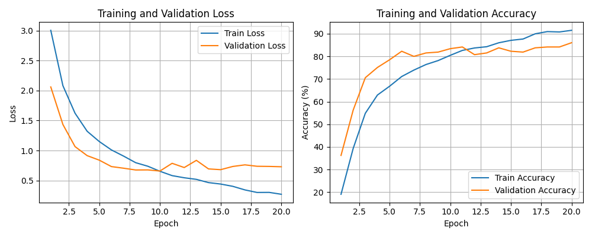
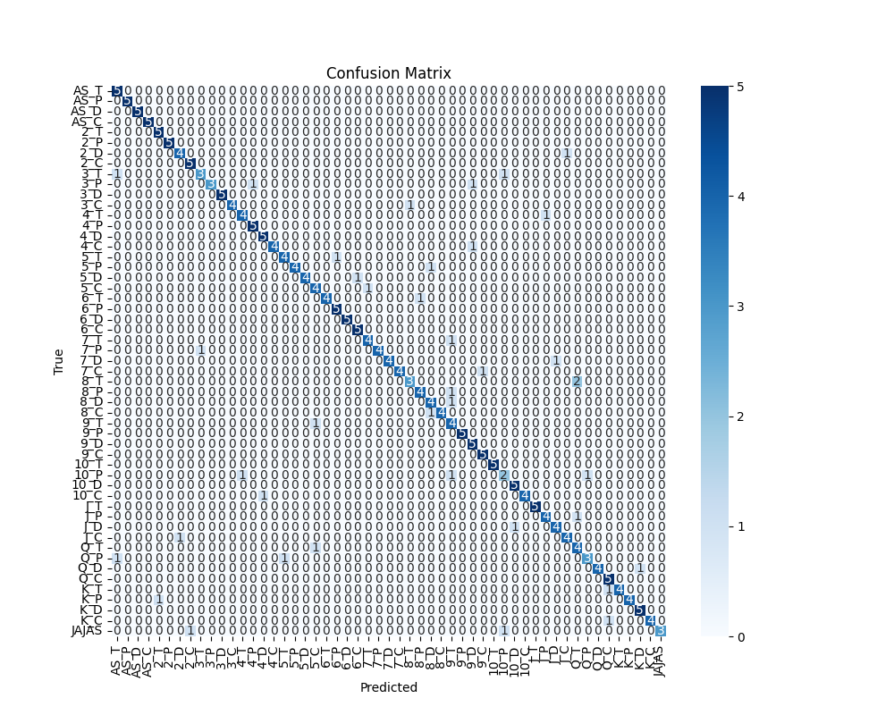
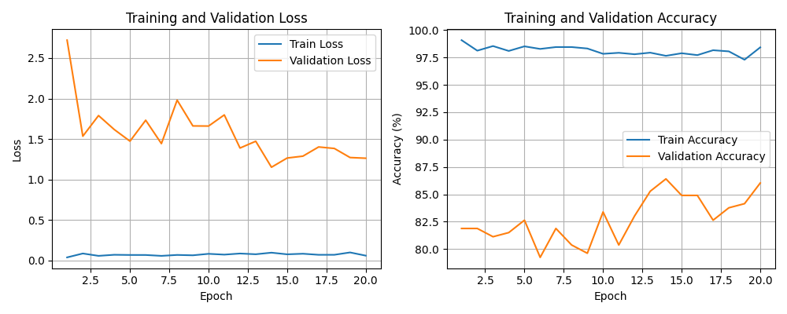
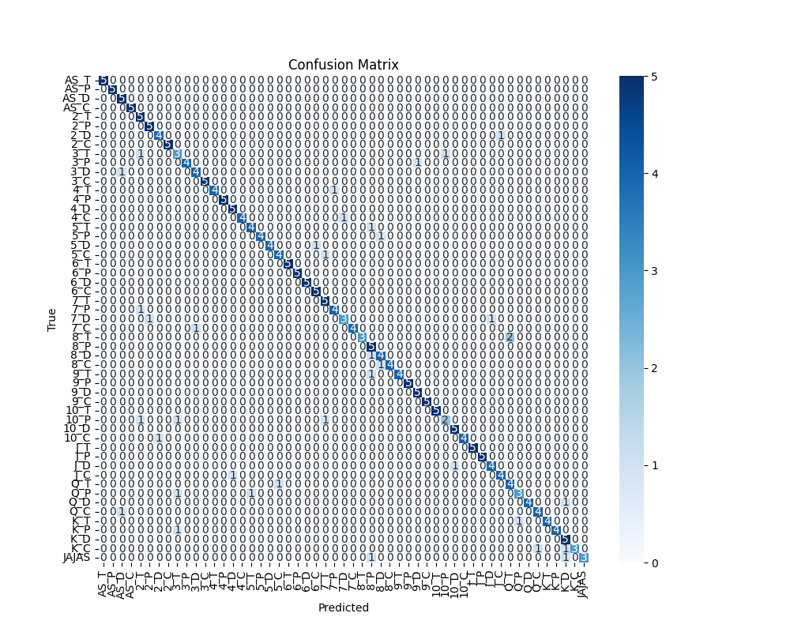
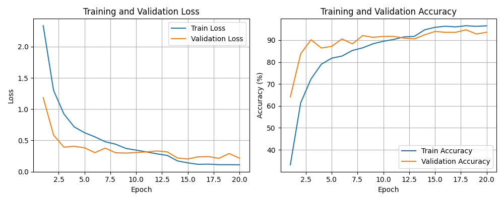
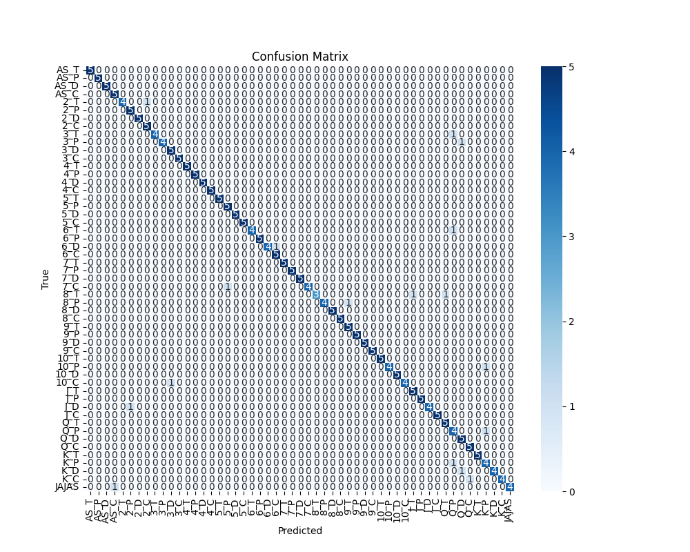

# **Configuración 2**

Configuración algo más conservadora. Con menos LR y algunas épocas más,  
de esta manera la red
avanzará más lento pero con más precisión

### **Hiperparametros**

**EPOCHS** = 15             
**LR** = 4e-3               
**SEED** = 0                
**BATCH_SIZE** = 16         
**FactorReduccion** = 0.75  
**Paciencia** = 3      

## Resultados sin pesos

_[Epoch 1]_ train_loss: 3.005 | train_acc: 19.05% | dev_loss: 2.061 | dev_acc: 36.23% | lr=0.000500  
_[Epoch 2]_ train_loss: 2.082 | train_acc: 39.28% | dev_loss: 1.434 | dev_acc: 56.23% | lr=0.000500  
_[Epoch 3]_ train_loss: 1.622 | train_acc: 54.83% | dev_loss: 1.065 | dev_acc: 70.57% | lr=0.000500  
_[Epoch 4]_ train_loss: 1.321 | train_acc: 62.91% | dev_loss: 0.914 | dev_acc: 75.09% | lr=0.000500  
_[Epoch 5]_ train_loss: 1.149 | train_acc: 66.79% | dev_loss: 0.839 | dev_acc: 78.49% | lr=0.000500  
_[Epoch 6]_ train_loss: 1.009 | train_acc: 71.09% | dev_loss: 0.732 | dev_acc: 82.26% | lr=0.000500  
_[Epoch 7]_ train_loss: 0.907 | train_acc: 73.92% | dev_loss: 0.705 | dev_acc: 80.00% | lr=0.000500  
_[Epoch 8]_ train_loss: 0.797 | train_acc: 76.39% | dev_loss: 0.675 | dev_acc: 81.51% | lr=0.000500  
_[Epoch 9]_ train_loss: 0.737 | train_acc: 78.13% | dev_loss: 0.676 | dev_acc: 81.89% | lr=0.000500  
_[Epoch 10]_ train_loss: 0.653 | train_acc: 80.46% | dev_loss: 0.658 | dev_acc: 83.40% | lr=0.000500  
_[Epoch 11]_ train_loss: 0.581 | train_acc: 82.63% | dev_loss: 0.786 | dev_acc: 84.15% | lr=0.000500  
_[Epoch 12]_ train_loss: 0.545 | train_acc: 83.71% | dev_loss: 0.716 | dev_acc: 80.75% | lr=0.000500  
_[Epoch 13]_ train_loss: 0.519 | train_acc: 84.26% | dev_loss: 0.836 | dev_acc: 81.51% | lr=0.000500  
_[Epoch 14]_ train_loss: 0.464 | train_acc: 86.00% | dev_loss: 0.693 | dev_acc: 83.77% | lr=0.000500  
_[Epoch 15]_ train_loss: 0.440 | train_acc: 87.08% | dev_loss: 0.680 | dev_acc: 82.26% | lr=0.000500  
_[Epoch 16]_ train_loss: 0.402 | train_acc: 87.67% | dev_loss: 0.734 | dev_acc: 81.89% | lr=0.000375  
_[Epoch 17]_ train_loss: 0.343 | train_acc: 89.97% | dev_loss: 0.761 | dev_acc: 83.77% | lr=0.000375   
_[Epoch 18]_ train_loss: 0.300 | train_acc: 90.95% | dev_loss: 0.737 | dev_acc: 84.15% | lr=0.000375  
_[Epoch 19]_ train_loss: 0.301 | train_acc: 90.79% | dev_loss: 0.734 | dev_acc: 84.15% | lr=0.000375  
_[Epoch 20]_ train_loss: 0.270 | train_acc: 91.51% | dev_loss: 0.729 | dev_acc: 86.04% | lr=0.000375   

Evaluación final en test **Accuracy final en test: 86.04%** 

**Función de pérdida y de precisión**

**Matríz de Confusión**

  
  
**Resultados con pesos**

_[Epoch 1]_ train_loss: 0.062 | train_acc: 98.20% | dev_loss: 1.571 | dev_acc: 82.26% | lr=0.000500  
_[Epoch 2]_ train_loss: 0.093 | train_acc: 97.31% | dev_loss: 1.315 | dev_acc: 83.02% | lr=0.000500  
_[Epoch 3]_  train_loss: 0.093 | train_acc: 97.63% | dev_loss: 1.523 | dev_acc: 79.62% | lr=0.000500  
_[Epoch 4]_  train_loss: 0.078 | train_acc: 97.85% | dev_loss: 1.227 | dev_acc: 84.15% | lr=0.000500  
_[Epoch 5]_  train_loss: 0.097 | train_acc: 97.04% | dev_loss: 1.143 | dev_acc: 84.53% | lr=0.000500  
_[Epoch 6]_  train_loss: 0.086 | train_acc: 97.68% | dev_loss: 1.132 | dev_acc: 83.02% | lr=0.000500  
_[Epoch 7]_  train_loss: 0.089 | train_acc: 97.22% | dev_loss: 1.031 | dev_acc: 84.15% | lr=0.000500  
_[Epoch 8]_ train_loss: 0.104 | train_acc: 97.23% | dev_loss: 1.076 | dev_acc: 81.13% | lr=0.000500  
_[Epoch 9]_ train_loss: 0.083 | train_acc: 97.68% | dev_loss: 1.008 | dev_acc: 81.13% | lr=0.000500  
_[Epoch 10]_ train_loss: 0.083 | train_acc: 97.49% | dev_loss: 1.201 | dev_acc: 83.40% | lr=0.000250  
_[Epoch 11]_ train_loss: 0.073 | train_acc: 98.22% | dev_loss: 0.998 | dev_acc: 82.26% | lr=0.000250  
_[Epoch 12]_ train_loss: 0.049 | train_acc: 98.49% | dev_loss: 1.064 | dev_acc: 84.53% | lr=0.000250  
_[Epoch 13]_ train_loss: 0.043 | train_acc: 98.81% | dev_loss: 1.038 | dev_acc: 83.40% | lr=0.000250  
_[Epoch 14]_ train_loss: 0.043 | train_acc: 98.83% | dev_loss: 1.053 | dev_acc: 83.02% | lr=0.000250  
_[Epoch 15]_ train_loss: 0.048 | train_acc: 98.54% | dev_loss: 1.195 | dev_acc: 86.04% | lr=0.000250  
_[Epoch 16]_ train_loss: 0.037 | train_acc: 98.92% | dev_loss: 1.171 | dev_acc: 84.91% | lr=0.000250  
_[Epoch 17]_ train_loss: 0.049 | train_acc: 98.66% | dev_loss: 1.073 | dev_acc: 86.79% | lr=0.000250  
_[Epoch 18]_ train_loss: 0.054 | train_acc: 98.69% | dev_loss: 1.164 | dev_acc: 81.13% | lr=0.000250  
_[Epoch 19]_ train_loss: 0.051 | train_acc: 98.32% | dev_loss: 1.190 | dev_acc: 84.53% | lr=0.000250  
_[Epoch 20]_ train_loss: 0.054 | train_acc: 98.48% | dev_loss: 1.214 | dev_acc: 85.31% | lr=0.000250  

Evaluación final en test: **Accuracy final de 85.31%**

**Función de pérdida y de precisión**

**Matríz de Confusión**

**Referencia en Commit**

_[Epoch 1]_ train_loss: 2.335 | train_acc: 33.17% | dev_loss: 1.185 | dev_acc: 64.15% | lr=0.000500  
_[Epoch 2]_ train_loss: 1.301 | train_acc: 61.40% | dev_loss: 0.586 | dev_acc: 83.77% | lr=0.000500  
_[Epoch 3]_ train_loss: 0.925 | train_acc: 72.30% | dev_loss: 0.393 | dev_acc: 90.19% | lr=0.000500  
_[Epoch 4]_ train_loss: 0.716 | train_acc: 79.01% | dev_loss: 0.406 | dev_acc: 86.42% | lr=0.000500  
_[Epoch 5]_ train_loss: 0.624 | train_acc: 81.77% | dev_loss: 0.383 | dev_acc: 87.17% | lr=0.000500  
_[Epoch 6]_ train_loss: 0.557 | train_acc: 82.74% | dev_loss: 0.305 | dev_acc: 90.57% | lr=0.000500  
_[Epoch 7]_ train_loss: 0.480 | train_acc: 85.28% | dev_loss: 0.377 | dev_acc: 88.30% | lr=0.000500  
_[Epoch 8]_ train_loss: 0.440 | train_acc: 86.49% | dev_loss: 0.303 | dev_acc: 92.08% | lr=0.000500  
_[Epoch 9]_ train_loss: 0.373 | train_acc: 88.34% | dev_loss: 0.298 | dev_acc: 91.32% | lr=0.000500  
_[Epoch 10]_ train_loss: 0.345 | train_acc: 89.49% | dev_loss: 0.307 | dev_acc: 91.70% | lr=0.000500  
_[Epoch 11]_ train_loss: 0.317 | train_acc: 90.31% | dev_loss: 0.317 | dev_acc: 91.70% | lr=0.000500  
_[Epoch 12]_ train_loss: 0.286 | train_acc: 91.47% | dev_loss: 0.332 | dev_acc: 90.94% | lr=0.000500  
_[Epoch 13]_ train_loss: 0.260 | train_acc: 91.71% | dev_loss: 0.317 | dev_acc: 90.57% | lr=0.000250  
_[Epoch 14]_ train_loss: 0.172 | train_acc: 94.71% | dev_loss: 0.219 | dev_acc: 92.45% | lr=0.000250  
_[Epoch 15]_ train_loss: 0.141 | train_acc: 95.84% | dev_loss: 0.204 | dev_acc: 93.96% | lr=0.000250  
_[Epoch 16]_ train_loss: 0.118 | train_acc: 96.34% | dev_loss: 0.239 | dev_acc: 93.58% | lr=0.000250  
_[Epoch 17]_ train_loss: 0.121 | train_acc: 96.04% | dev_loss: 0.242 | dev_acc: 93.58% | lr=0.000250  
_[Epoch 18]_ train_loss: 0.112 | train_acc: 96.58% | dev_loss: 0.214 | dev_acc: 94.72% | lr=0.000250  
_[Epoch 19]_ train_loss: 0.112 | train_acc: 96.30% | dev_loss: 0.291 | dev_acc: 92.83% | lr=0.000250  
_[Epoch 20]_ train_loss: 0.111 | train_acc: 96.54% | dev_loss: 0.216 | dev_acc: 93.58% | lr=0.000250  

Evaluación final en test **Accuracy final en test: 93.58%**

## Función de pérdida y de precisión

## Matríz de Confusión

