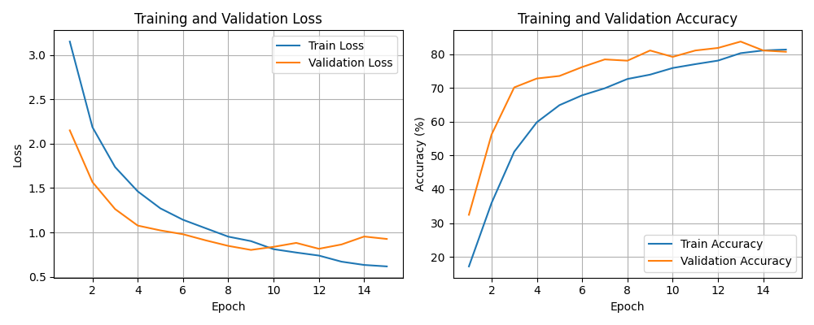
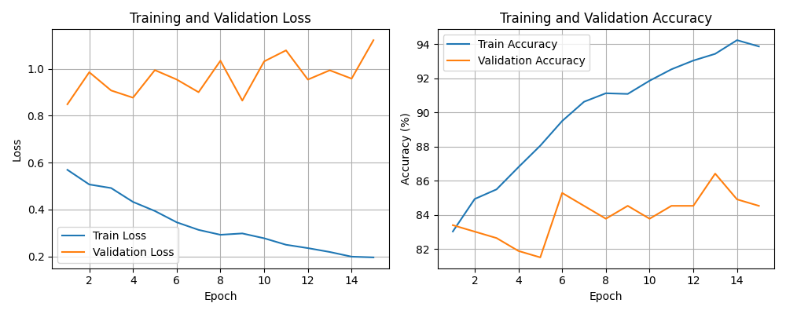
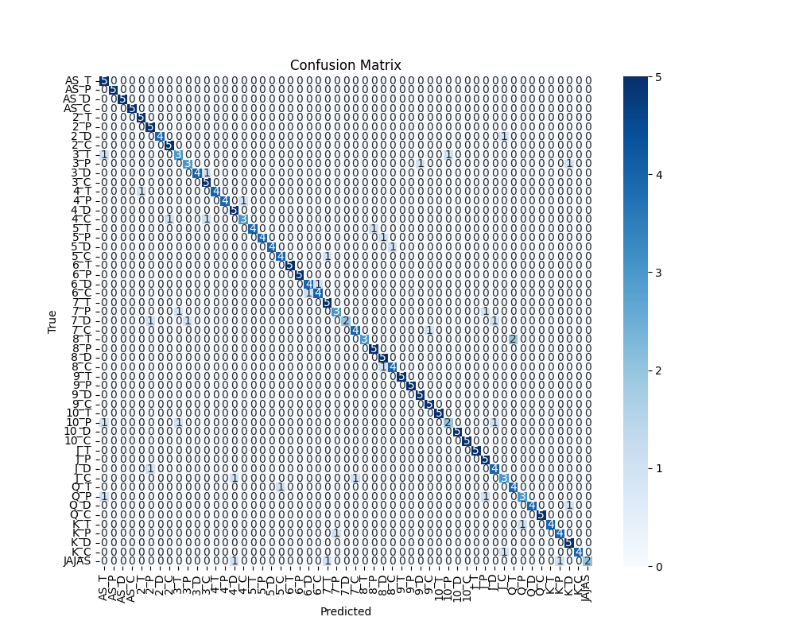
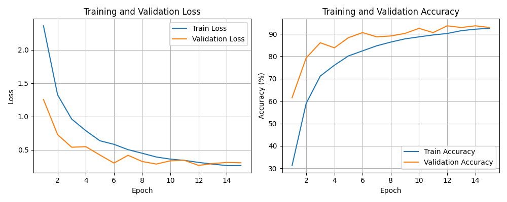
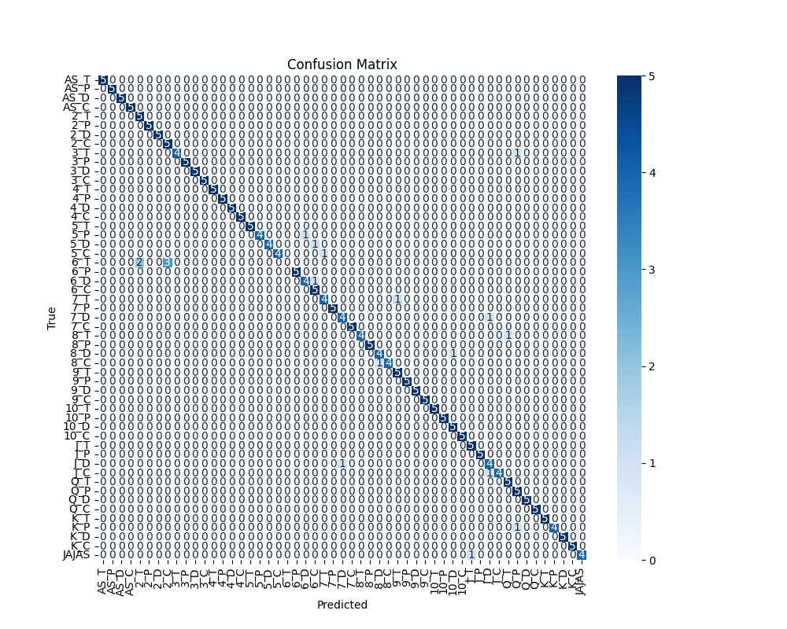

# **Configuración 3**

Esta es la configuracion estandar de nuestra red neuronal.

# ***Hiperparametros***
EPOCHS = 15
LR = 1e-3
SEED = 0
BATCH_SIZE =32
FactorReduccion = 0.75
Paciencia = 3

**Resultados sin pesos**

[Epoch 1] train_loss: 3.150 | train_acc: 17.16% | dev_loss: 2.149 | dev_acc: 32.45% | lr=0.001000  
[Epoch 2] train_loss: 2.186 | train_acc: 35.95% | dev_loss: 1.567 | dev_acc: 56.23% | lr=0.001000  
[Epoch 3] train_loss: 1.736 | train_acc: 51.13% | dev_loss: 1.263 | dev_acc: 70.19% | lr=0.001000  
[Epoch 4] train_loss: 1.462 | train_acc: 59.88% | dev_loss: 1.077 | dev_acc: 72.83% | lr=0.001000  
[Epoch 5] train_loss: 1.271 | train_acc: 64.94% | dev_loss: 1.023 | dev_acc: 73.58% | lr=0.001000  
[Epoch 6] train_loss: 1.142 | train_acc: 67.85% | dev_loss: 0.980 | dev_acc: 76.23% | lr=0.001000  
[Epoch 7] train_loss: 1.047 | train_acc: 69.94% | dev_loss: 0.911 | dev_acc: 78.49% | lr=0.001000  
[Epoch 8] train_loss: 0.952 | train_acc: 72.69% | dev_loss: 0.848 | dev_acc: 78.11% | lr=0.001000  
[Epoch 9] train_loss: 0.902 | train_acc: 73.98% | dev_loss: 0.803 | dev_acc: 81.13% | lr=0.001000  
[Epoch 10] train_loss: 0.811 | train_acc: 75.94% | dev_loss: 0.838 | dev_acc: 79.25% | lr=0.001000  
[Epoch 11] train_loss: 0.774 | train_acc: 77.09% | dev_loss: 0.882 | dev_acc: 81.13% | lr=0.001000  
[Epoch 12] train_loss: 0.739 | train_acc: 78.13% | dev_loss: 0.816 | dev_acc: 81.89% | lr=0.001000  
[Epoch 13] train_loss: 0.671 | train_acc: 80.34% | dev_loss: 0.864 | dev_acc: 83.77% | lr=0.001000  
[Epoch 14] train_loss: 0.634 | train_acc: 81.15% | dev_loss: 0.954 | dev_acc: 81.13% | lr=0.001000  
[Epoch 15] train_loss: 0.617 | train_acc: 81.40% | dev_loss: 0.926 | dev_acc: 80.75% | lr=0.001000  

Evaluación final en test: 
**Accuracy final en test: 80.75%**

Función de pérdida y de precision

Matriz de Confusion

**Resultados con pesos**

[Epoch 1] train_loss: 0.569 | train_acc: 83.03% | dev_loss: 0.848 | dev_acc: 83.40% | lr=0.001000  
[Epoch 2] train_loss: 0.507 | train_acc: 84.93% | dev_loss: 0.985 | dev_acc: 83.02% | lr=0.001000  
[Epoch 3] train_loss: 0.491 | train_acc: 85.49% | dev_loss: 0.907 | dev_acc: 82.64% | lr=0.001000  
[Epoch 4] train_loss: 0.432 | train_acc: 86.79% | dev_loss: 0.877 | dev_acc: 81.89% | lr=0.001000  
[Epoch 5] train_loss: 0.393 | train_acc: 88.05% | dev_loss: 0.994 | dev_acc: 81.51% | lr=0.000750  
[Epoch 6] train_loss: 0.345 | train_acc: 89.49% | dev_loss: 0.954 | dev_acc: 85.28% | lr=0.000750  
[Epoch 7] train_loss: 0.313 | train_acc: 90.62% | dev_loss: 0.900 | dev_acc: 84.53% | lr=0.000750  
[Epoch 8] train_loss: 0.292 | train_acc: 91.12% | dev_loss: 1.034 | dev_acc: 83.77% | lr=0.000750  
[Epoch 9] train_loss: 0.298 | train_acc: 91.08% | dev_loss: 0.864 | dev_acc: 84.53% | lr=0.000750  
[Epoch 10] train_loss: 0.277 | train_acc: 91.85% | dev_loss: 1.031 | dev_acc: 83.77% | lr=0.000563  
[Epoch 11] train_loss: 0.249 | train_acc: 92.52% | dev_loss: 1.079 | dev_acc: 84.53% | lr=0.000563  
[Epoch 12] train_loss: 0.235 | train_acc: 93.04% | dev_loss: 0.954 | dev_acc: 84.53% | lr=0.000563  
[Epoch 13] train_loss: 0.219 | train_acc: 93.43% | dev_loss: 0.993 | dev_acc: 86.42% | lr=0.000563  
[Epoch 14] train_loss: 0.199 | train_acc: 94.23% | dev_loss: 0.958 | dev_acc: 84.91% | lr=0.000563  
[Epoch 15] train_loss: 0.195 | train_acc: 93.86% | dev_loss: 1.122 | dev_acc: 84.53% | lr=0.000563  

Evaluación final en test: **Accuracy final en test: 84.53%**

Función de pérdida y de precision

Matriz de Confusion

**Resultados usando Transfer Leaarning**

[Epoch 1] train_loss: 2.360 | train_acc: 31.20% | dev_loss: 1.255 | dev_acc: 61.51% | lr=0.001000  
[Epoch 2] train_loss: 1.325 | train_acc: 58.96% | dev_loss: 0.728 | dev_acc: 79.25% | lr=0.001000  
[Epoch 3] train_loss: 0.961 | train_acc: 71.14% | dev_loss: 0.539 | dev_acc: 86.04% | lr=0.001000  
[Epoch 4] train_loss: 0.787 | train_acc: 76.01% | dev_loss: 0.547 | dev_acc: 83.77% | lr=0.001000  
[Epoch 5] train_loss: 0.636 | train_acc: 80.15% | dev_loss: 0.422 | dev_acc: 88.30% | lr=0.001000  
[Epoch 6] train_loss: 0.582 | train_acc: 82.42% | dev_loss: 0.301 | dev_acc: 90.57% | lr=0.001000  
[Epoch 7] train_loss: 0.502 | train_acc: 84.67% | dev_loss: 0.418 | dev_acc: 88.68% | lr=0.001000  
[Epoch 8] train_loss: 0.449 | train_acc: 86.33% | dev_loss: 0.325 | dev_acc: 89.06% | lr=0.001000  
[Epoch 9] train_loss: 0.392 | train_acc: 87.76% | dev_loss: 0.287 | dev_acc: 90.19% | lr=0.001000  
[Epoch 10] train_loss: 0.360 | train_acc: 88.67% | dev_loss: 0.335 | dev_acc: 92.45% | lr=0.001000  
[Epoch 11] train_loss: 0.341 | train_acc: 89.51% | dev_loss: 0.342 | dev_acc: 90.57% | lr=0.001000  
[Epoch 12] train_loss: 0.311 | train_acc: 90.16% | dev_loss: 0.266 | dev_acc: 93.58% | lr=0.001000  
[Epoch 13] train_loss: 0.286 | train_acc: 91.42% | dev_loss: 0.295 | dev_acc: 92.83% | lr=0.001000  
[Epoch 14] train_loss: 0.263 | train_acc: 92.09% | dev_loss: 0.310 | dev_acc: 93.58% | lr=0.001000  
[Epoch 15] train_loss: 0.264 | train_acc: 92.48% | dev_loss: 0.306 | dev_acc: 92.83% | lr=0.001000  

Evaluación final en test: **Accuracy final en test: 92.83%**

Función de pérdida y de precision

Matriz de Confusion

